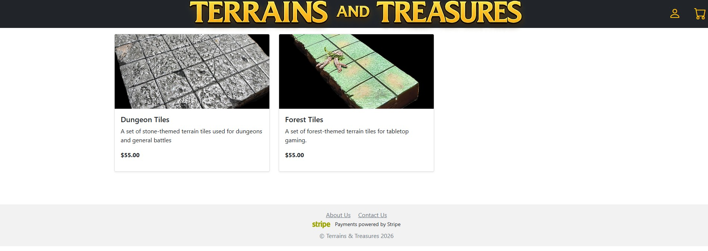
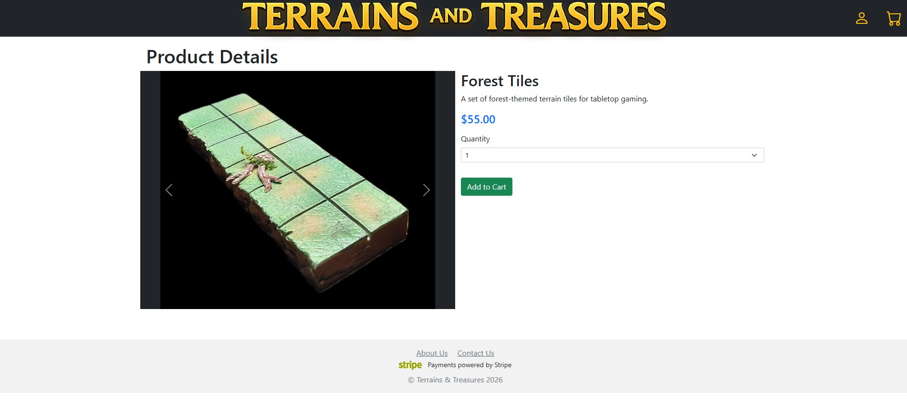
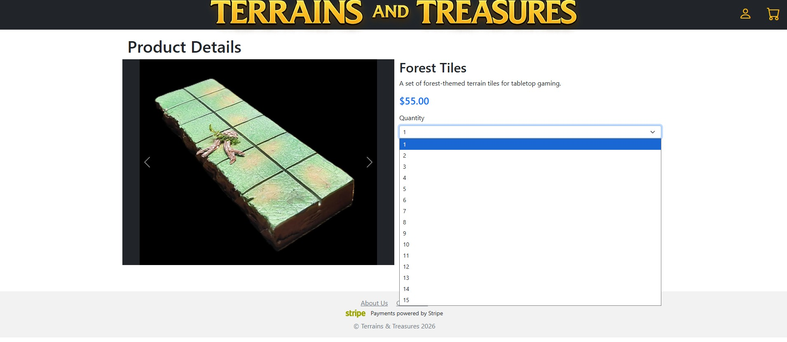
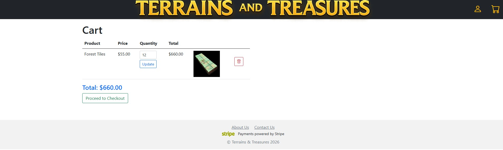
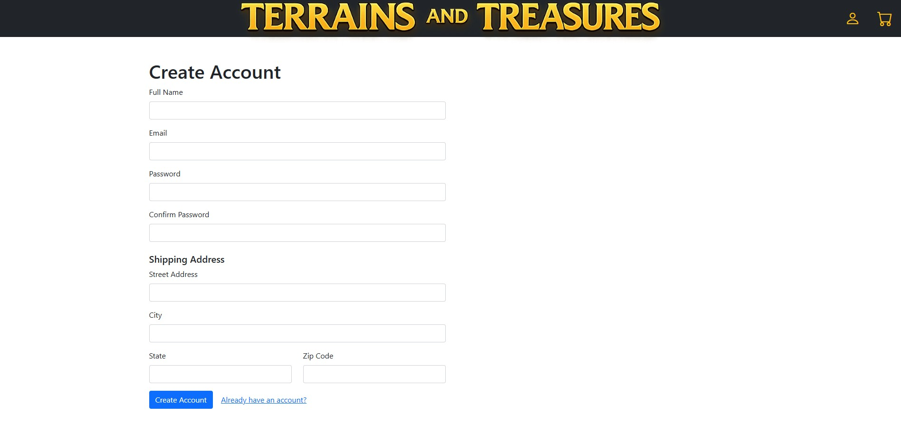
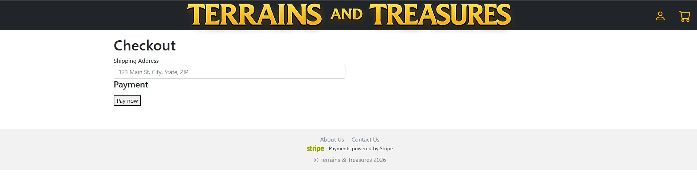
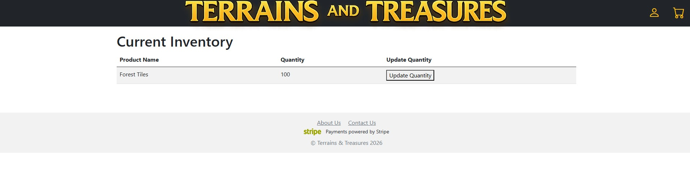
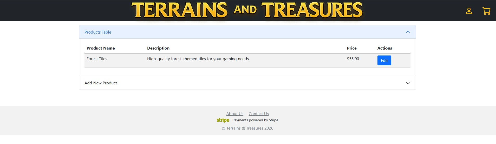
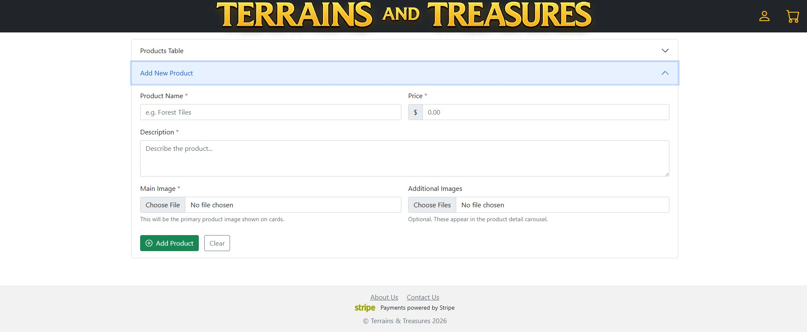

# Terrains & Treasures Online Store Prototype

## Use Cases UC-01 ~ UC-05 
#### This prototype will show the flow from user loading the home page to checking out (All these screenshots are from HTML/Bootstrap not drawings)

### Landing page

 users can browse all products. There will be a filter and search added later 
 
### Product Details

Once user selects the prodcut the products detail pages is loaded with a carousel of images.
The quantity is generated form the inventory database and double cheked just before purchase to prevent ordering out of stock products. 

### Cart

Once user selects product it sends them to cart. Will add a modal that popus and asks user if they want to keep shopping or go to cart 

### Account Registration 

displays if user is not logged in but clicks check out but will make a modal that offers guest checkout 

### Checkout 

Currently doesnt have Stripe elements but this is where it will be located. 
after checkout Email sent to user with receipt

## User stories 4 + 5 
#### This will show the admin section of the website. 

### Inventory 

This lists all the products and their current quantitys and if it is below a certain amount itll show up in red to be seen at a galnce. 

### Products Page

This page allows admins to edit any info about a product as well as add a new product 

### Admin Dashboard
This is not set up yet, however it will have 5 visual aids for the admin  
A month to month sales line graph  
Top 5 sold products and % of sales they are pie chart  
Cusomter aqustion month over month (new accounts created)  
Bottom 5 products  
Average oder total month over month. 
