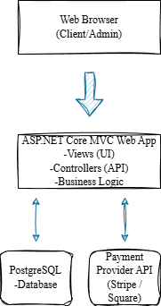
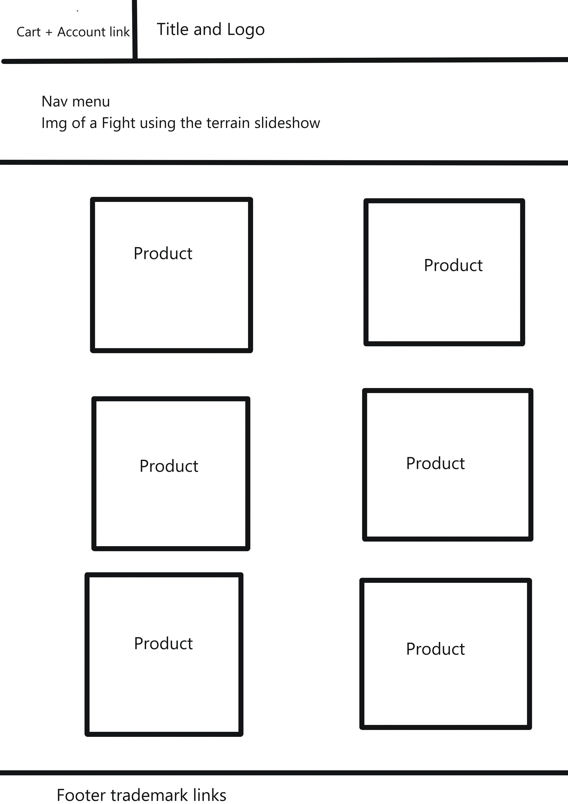
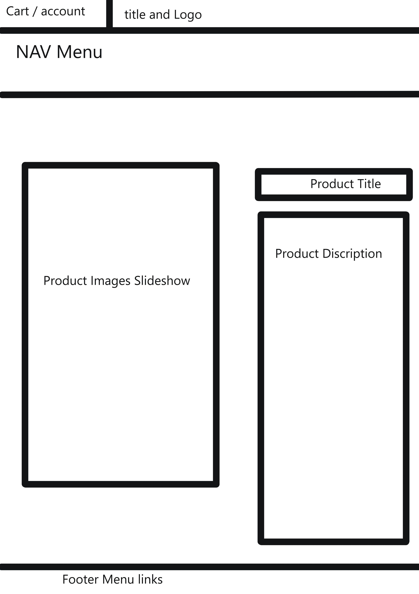
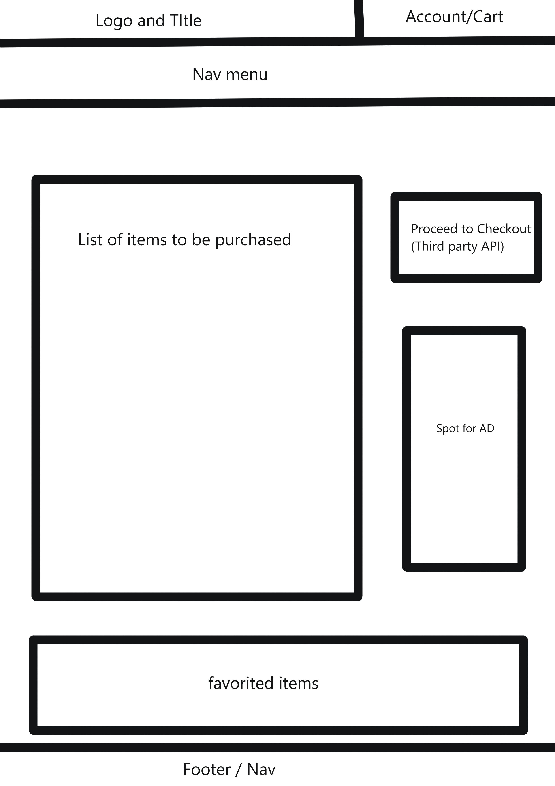
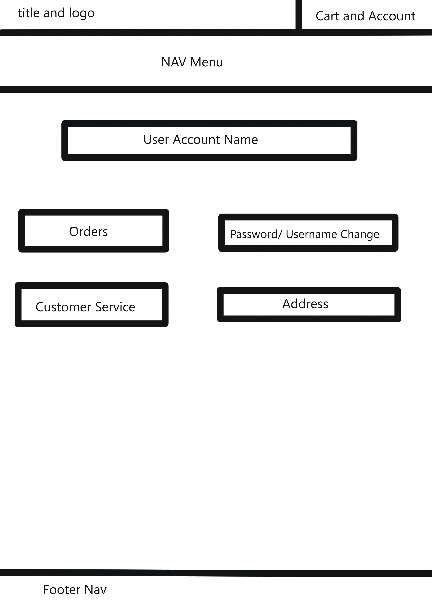

# Terrains & Treasures Online Store 

Online storefront for my D&amp;D Terrain, The purpose of this software is to move my tabletop gaming products business from Etsy to a dedicated, cloud-hosted web application. The store will allow me to have full control of the sales process and customize the user experience. It will handle product browsing, cart management, order placement, and account management. I will be building it using ASP.NET Core MVC along with third party APIs to handle payment and shipping 

## Functional Requirements 
The software lets the user register an account, browse product categories, add items to shopping cart, complete purchase, and check status of existing orders. Data will be stored using PostgreSQL and EF Core to connect it to the store. The following data will be stored in the database
  *	User details (ID, names, email, address, phone, registration date)
  *	Product details (ID, names, descriptions, prices)
  *	Order records (ID, user ID, product IDs, date/time)
  *	Inventory levels (ID, product ID, amount)
  *	Transaction records (ID, Order ID, date/time)
  *	Shipping information (ID, tracking numbers, carrier)

## Input, Processing, Output

### Input
Users will input product selections, personal information for accounts, and payment details. The product details and inventory levels will be inputted by me. The product details will be updated as new products come out through an admin screen, time permitting. Inventory levels will be updated automatically as products are purchased or updated in the admin screen.

### Processing
The system will handle updating inventory, order validation, and user authentication. Payment processing via a third-party API. I will be using either Stripe or Square for this functionality. Shipment tracking will be handled by storing carriers and tracking info in the database and providing direct links to the official tracking page.

### Output
There will be receipts created and automatic emails sent out upon order confirmation. There will also be an account dashboard where the user info will be displayed. There may be some administrative report functionality built in time permitting.

## Architecture Block Diagram

## Wireframes

### Home 

### Product Detail

### Cart

### Account 

- User must be logged in to view Account
## User Stories 
